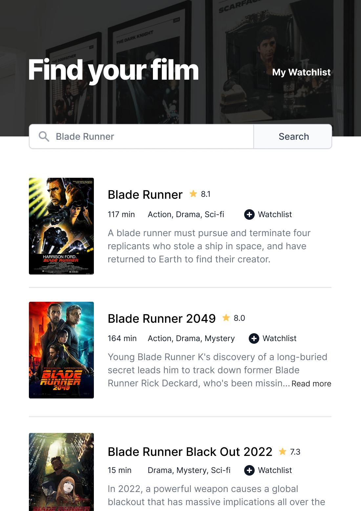
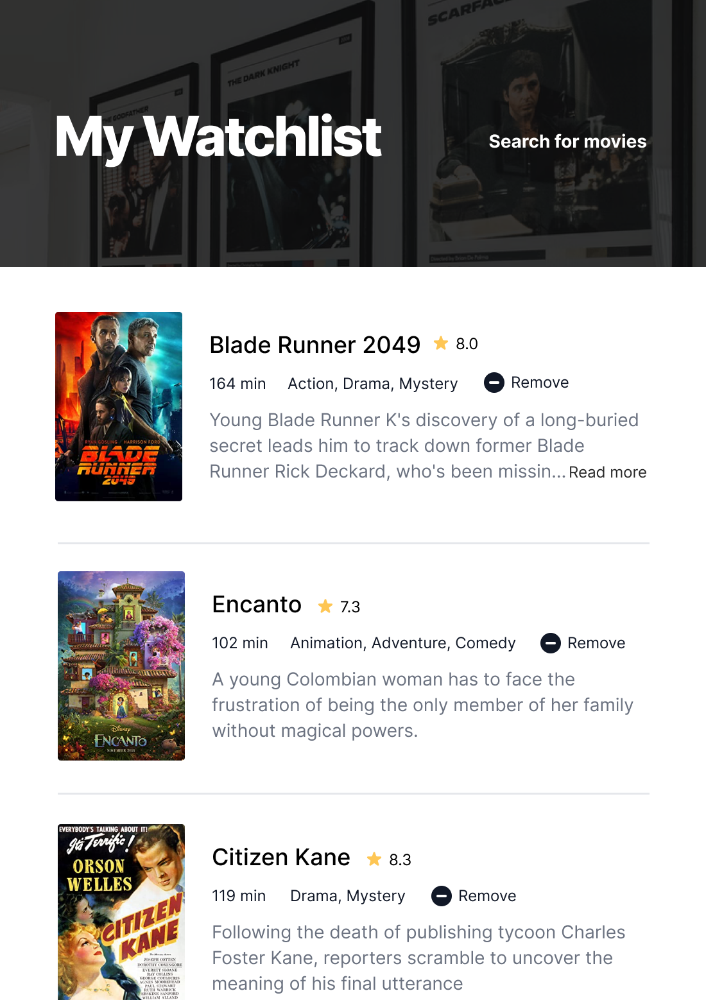

# Movie Watchlist

A solo project from [Scrimba](https://scrimba.com/learn/frontend) frontend developer career path.

Movie Watchlist is a web app for movie buffs. Search for movie titles to discover and revisit movies effortlessly by saving your favorites to your watchlist!

## Overview

### The challenge

Users should be able to:

- Search for movies using the OMDb API
- Add movies to watchlist
- Remove movies from watchlist

## Technologies featured

`HTML` `CSS` `Flexbox` `Javascript` `OMDb API` `localStorage`

 &nbsp; &nbsp; 
